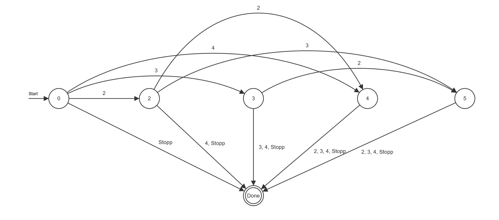
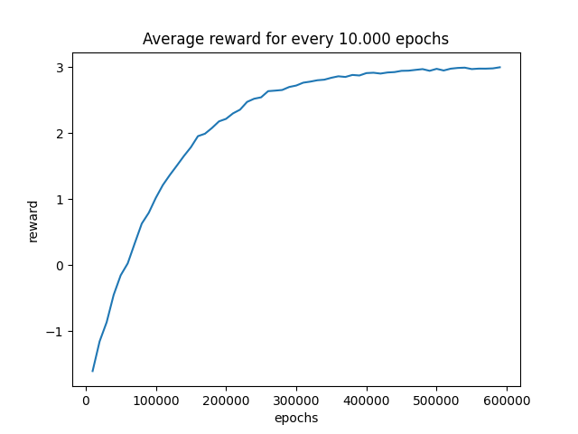

# Q-learning-micro-blackjack

<!-- ABOUT THE PROJECT -->
## About the project
Implementation of Q-learning for solving Micro-Blackjack. 

Micro-Blackjack:
Goal: Have the highest number of cards less or equal of 5.
- Actions: `Stopp`You stopp drawing new cards `Draw`You draw 2,3 or 4 new additional cards (event is non-deterministic)
- You lose if you have more than 5 cards 

## Visualization of Micro Blackjack:

## Visualization of learning prozess 

## Results
<pre>   State  q-value-stopp  q-value-draw  optimal action
0      0      -0.250000      7.510141               1
1      1      -4.518985     -2.205099               1
2      2       4.750000      4.703329               0
3      3       4.750000      2.119898               0
4      4       4.750000     -0.250001               0
</pre>

## Prerequisites

- `Python ≥3.6.0`
- `Numpy`
- `Pandas`
- `MatPlotLib`

<!-- LICENSE -->
## License

Distributed under the Apache License 2.0 License. See `LICENSE.txt` for more information.

